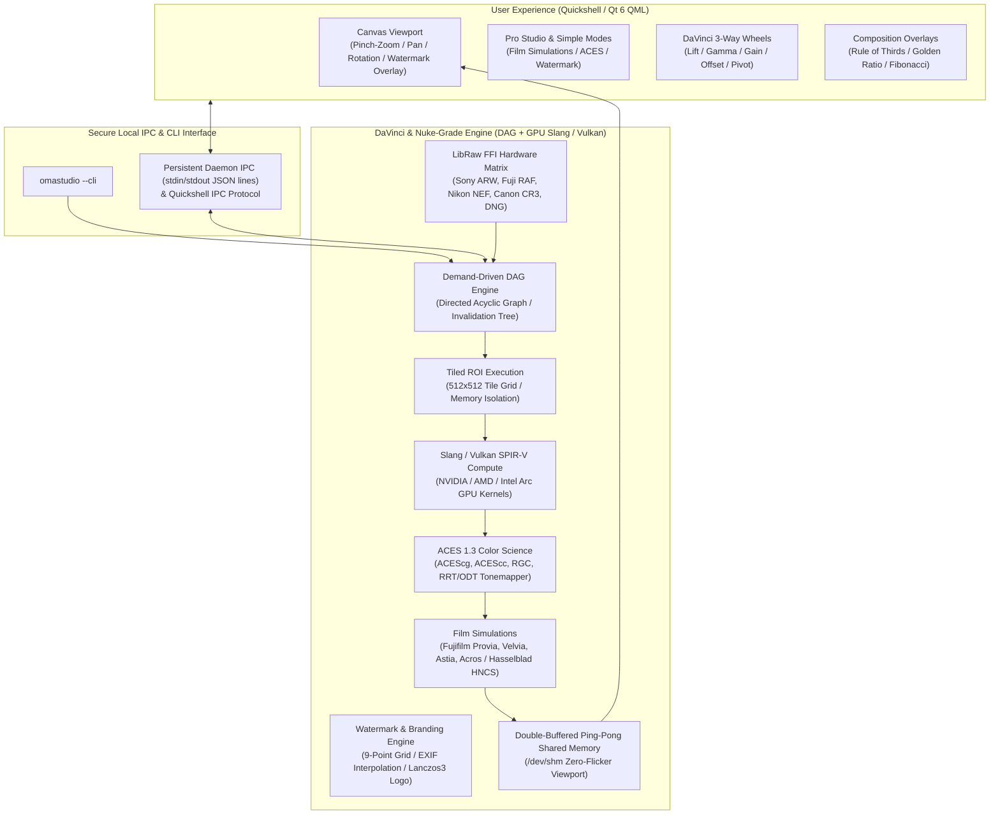

# OmaStudio

[](https://github.com/ozdil)

**Quickshell & Rust-Powered Premier Photo RAW Studio for Omarchy Linux**

*Parametric non-destructive RAW editing, ACES 1.3 color management & Reference Gamut Compression, authentic Fujifilm & Hasselblad film simulations, Hollywood-standard DaVinci 3-Way color wheels, customizable photography watermarking, offline AI Jev decision engine, dual storage (Local + Google Drive), and modern multi-format export pipeline.*

[English](README.md) • [Türkçe](README.tr.md)

[](LICENSE)
[](https://omarchy.org)
[](Cargo.toml)
[](qml/)
[](CONTRIBUTING.md)
[](https://github.com/ozdil)
[](https://buymeacoffee.com/ozdil)


---

## Architecture & Principles

OmaStudio employs an industry-leading hybrid architecture designed for extreme performance on modern Wayland and Hyprland Linux desktops: The graphical user interface runs at 120/144 FPS powered by GPU-accelerated **Quickshell (Qt 6 / QML)**, while the mathematical image processing and RAW decoding pipeline is driven by a **Directed Acyclic Graph (DAG) Engine, Tiled Region-of-Interest (ROI) Execution, and Rust + Vulkan/Slang GPU Compute**.



---

## RAW Processing Pipeline

Every RAW pixel undergoes lossless, mathematically precise transformations to preserve maximum dynamic range:

```mermaid
flowchart LR
    A[" RAW Input<br/>(Bayer / X-Trans)"] --> B[" LibRaw<br/>Demosaicing"]
    B --> C[" White Balance<br/>(Planckian AWB)"]
    C --> D[" Linear Exposure<br/>(Zone System EV)"]
    D --> E[" ACES 1.3 RGC<br/>(Gamut Compression)"]
    E --> F[" Film Simulation<br/>(Fuji / Hasselblad)"]
    F --> G[" DaVinci Wheels<br/>(Pivot & Boost)"]
    G --> H[" Detail & Optics<br/>(Sharpness / Denoise)"]
    H --> I[" Watermark Engine<br/>(9-Point Grid / EXIF)"]
    I --> J[" Multi-Format Export<br/>(JXL / AVIF / TIFF 16-Bit)"]
```



---

## Key Features

### 1. ACES 1.3 Color Management & Reference Gamut Compression (RGC)
* **ACEScg & ACEScc Color Spaces:** Scene-referred AP1 linear working space with high-precision Bradford chromatic adaptation matrices for sRGB, Display P3, and Rec.2020.
* **ACES 1.3 Reference Gamut Compression (RGC):** Smoothly compresses out-of-gamut and highly saturated specular highlights toward the achromatic axis, eliminating ugly color clipping and neon-edge distortion.
* **ACES 1.3 Fitted RRT/ODT Tonemapping:** Rational polynomial approximation (Stephen Hill / Krzysztof Narkowicz) delivering cinematic shoulder roll-off and rich shadow gradation.

### 2. Authentic Film Simulations (Fujifilm & Hasselblad HNCS)
* **Fujifilm Daylight & Landscape:**
  * **Provia 100F:** Standard daylight color rendition with natural skin tones and neutral contrast.
  * **Velvia 50:** High-saturation, vibrant landscape film simulation with rich skies and foliage separation.
  * **Astia 100F:** Soft contrast and delicate gradations tailored for portrait photography.
* **Fujifilm Documentary & Cinematic:**
  * **Classic Chrome:** Muted saturation with deep, hard shadow contrast for documentary realism.
  * **Classic Neg:** Warm nostalgic tones with punchy midtone contrast inspired by Superia color negative film.
  * **Eterna Cinema:** Flat gamma and subdued color saturation delivering modern cinema highlight roll-off.
* **Fujifilm Acros Monochrome:**
  * **Acros Standard:** Legendary monochrome film with ultra-fine grain and rich tonal transitions.
  * **Acros (+Ye) Yellow Filter:** Moderate contrast lift, accentuating blue skies and portraits.
  * **Acros (+R) Red Filter:** Dramatic contrast with deep black skies and high micro-contrast.
  * **Acros (+G) Green Filter:** Emphasizes green foliage while softening lips and skin tones.
* **Hasselblad Medium Format Profiles:**
  * **Hasselblad Natural Colour Solution (HNCS):** 4th-root chroma scaling calibrated for medium-format studio photography, preserving neutral gray stability.
  * **Hasselblad XPan:** 35mm panoramic cinematic contrast with deep shadow compression.

### 3. Customizable Photography Watermark & Branding Engine
* **9-Point Anchor Grid:** Selectable alignment across 9 grid locations (Top-Left, Top-Center, Top-Right, Middle-Left, Center, Middle-Right, Bottom-Left, Bottom-Center, Bottom-Right).
* **EXIF Tag Interpolation:** Automatic token expansion for camera metadata: `{camera}`, `{lens}`, `{aperture}`, `{shutter}`, `{iso}`, and `{focal}`.
* **Custom Logo Overlay:** High-quality PNG logo blending with Lanczos3 resampling and alpha transparency.
* **Live Viewport Preview:** Non-destructive live preview directly inside the Viewport without requiring re-render.
* **Export Integration:** Embedded directly into final output files across JPEG XL, AVIF, WebP, TIFF 16-bit, PNG, and JPEG.

### 4. Strict Non-Destructive RAW Workflow
* **Original RAW Files Never Mutated:** Sensor RAW files are opened read-only; no bytes of the source file are ever modified.
* **Parametric Sidecar Architecture:** All recipes, grades, crops, and metadata adjustments reside strictly in `.omastudio` JSON sidecars with atomic write operations and Mode 0600 file permissions.

### 5. High-Depth 16-Bit / 26-Bit Medium Format Pipeline
* **Medium Format Sensors:** Fujifilm GFX series (GFX 100 II, GFX 100S, GFX 50S), Hasselblad (`.3FR`, `.DNG`), and Phase One 16-bit 100+ MP sensors.
* **16-Bit Processing Matrix:** Eliminates quantization banding during extreme shadow recovery (+4 EV, +100 Shadows).
* **Master 16-Bit Output:** Genuine 16-bit TIFF and 16-bit PNG (48-bit RGB) files for archival and gallery-grade print production.

### 6. Deterministic Computer Vision & Offline JEV Decision Engine
* **Linear Ansel Adams Zone System:** Computes exposure delta based on scene linear luminance rather than non-linear gamma values, protecting highlight headroom (ceiling check at 99th percentile).
* **Planckian Blackbody AWB:** Continuous correlated color temperature (CCT) estimator mapping 2400K to 9500K.
* **123-Degree Skin Tone Line Protection:** Vectorscope polar protection preserving facial hues regardless of scene saturation.
* **Multi-Cue Saliency:** Gradient magnitude and Rule of Thirds alignment for automated cropping and composition.
* **Offline JEV Intelligence:** Bayesian decision engine generating studio-grade presets even in air-gapped environments without external API connectivity.

### 7. DaVinci Resolve-Grade Color Science & Real-Time Scopes
* **Contrast Pivot:** Adjustable S-curve midpoint (0.05 to 0.95, default 0.435 / 18% middle gray) enabling contrast expansion without crushing shadows.
* **DaVinci Color Boost:** Non-linear chroma enhancement amplifying low-saturation tones while protecting saturated colors.
* **Midtone Detail (MD):** Frequency-separated band-pass filter isolating mid-frequencies to enhance micro-texture or soften skin tones.
* **Real-Time Video Scopes (60+ FPS):** Luma Waveform, RGB Parade, and Vectorscope with calibrated 123-degree Skin Tone Line.
* **3D LUT Engine (.cube):** Hardware-grade trilinear interpolation engine supporting standard `.cube` Look-Up Tables.
* **Local Grade Versions (A/B/C/D):** Hotkey-driven (`Alt + 1..4`) non-destructive recipe branching with instant cloning.

### 8. Wayland & Hyprland 120Hz/144Hz Zero-Tear Architecture
* **Double-Buffered Shared Memory:** `/dev/shm` ping-pong frame buffers eliminate render flickering during slider adjustments.
* **Mac-Calibrated Touchpad Ergonomics:** Continuous logarithmic pinch-to-zoom, 3.5-degree deadzone rotation guard, and kinetic panning.

---

## Feature Comparison

| Feature | OmaStudio | Adobe Lightroom | Darktable | RawTherapee |
| :--- | :---: | :---: | :---: | :---: |
| **License & Freedom** | **Open Source (MIT)** | Proprietary / Monthly Subscription | GPLv3 | GPLv3 |
| **Native Integration** | **Omarchy & Quickshell** | macOS / Windows Only | GTK | GTK |
| **ACES 1.3 & RGC** | **Native ACEScg / ACEScc / RGC** | Partial / ACES OCIO Plugin | Complex Modules | Complex Profiles |
| **Film Simulations** | **Authentic Fuji & Hasselblad** | Preset Packs | Curves | HaldCLUT |
| **Watermark Engine** | **9-Point Grid & EXIF Tags** | Export Preset Only | Watermark Module | Watermark Module |
| **DaVinci Color Science**| **Native (Pivot / Boost / MD)** | Partial | Complex Modules | Complex Profiles |
| **Real-Time Video Scopes**| **Waveform, Parade, Vectorscope (I-Bar)** | Histogram Only | Separate Windows | Separate Tabs |
| **3D LUT (.cube) & Mix** | **Hardware Trilinear & Presets** | Profile Library | LUT Module | HaldCLUT Only |
| **Local Grade Versions** | **A/B/C/D Instant Hotkeys** | Snapshots | History Stacks | Snapshots |
| **JPEG XL / AVIF Export** | **Hardware Accelerated** | Limited | Via Plugins | Partial |
| **Cloud Integration** | **Google Drive (Rclone FFI)**| Adobe Cloud (Enforced) | None | None |
| **Resource Footprint** | **Lightweight (~35 MB RAM)** | Heavy (2+ GB RAM) | Moderate (~400 MB) | Moderate (~350 MB) |

---

## Installation & Usage

### System Requirements & Dependencies
* `libraw` (RAW image decoding engine)
* `quickshell` (Qt 6 QML desktop shell runtime)
* `rclone` (Google Drive and cloud storage synchronization)
* `libjxl` & `libavif` (Modern hardware-accelerated image codecs)
* `exiftool` (Metadata and ICC profile embedding)
* `zenity` (Native file selection dialogs)
* `rust` (Toolchain for compiling the native engine)

### Build & Local Installation
```bash
# Clone and build the project
cargo build --release --locked

# Install the binary locally
install -d -m 755 ~/.local/bin
install -m 755 target/release/omastudio-engine ~/.local/bin/

# Launch OmaStudio
omastudio
```

---

## Keyboard Shortcuts & Workflow

* `Ctrl + O`: Open RAW image dialog
* `Ctrl + S`: Save adjustment recipe sidecar (`.omastudio`, Mode 0600)
* `Alt + 1..4`: Switch between Grade Versions (Version A, B, C, D)
* `C`: Toggle Crop & Composition mode (Rule of Thirds, Golden Ratio, Fibonacci)
* `Y`: Toggle Split Before / After (A|B) comparison
* `Ctrl + Shift + C`: Copy color & tone adjustments to clipboard
* `Ctrl + Shift + V`: Paste adjustments onto current photo
* `Ctrl + R`: Reset all adjustments to default values
* `Double Click`: Toggle between 100% Fit and 200% 1:1 Pixel Inspection

---

## Security Standards (`CONTRIBUTING.md`)

OmaStudio strictly conforms to the Omarchy Linux Security Standards:
1. **Isolated Process Groups (`cmd.process_group(0)`):** Subprocesses run in dedicated PGIDs; on timeout, RAII `ProcessGroupGuard` ensures clean cleanup with SIGTERM and SIGKILL, leaving zero zombies.
2. **Protected File Permissions (`0600` / `0700`):** Catalogs and configuration are written atomically (`.tmp_...` + `fs::rename`) with mode `0600`; symlink traversals are rejected.
3. **Quickshell Hardening:** Dynamic strings are rendered with `textFormat: Text.PlainText`; dynamic `eval()` and `createQmlObject()` are strictly prohibited.
4. **Argument Injection Defense:** System utilities are invoked with discrete argument vectors and the `--` delimiter to block flag injection.

---

## Support & Sponsorship

If you find OmaStudio valuable and want to fuel independent Linux software development:

<a href="https://buymeacoffee.com/ozdil" target="_blank"></a>

---

## License
MIT License (c) 2026 Ozan Özdil
