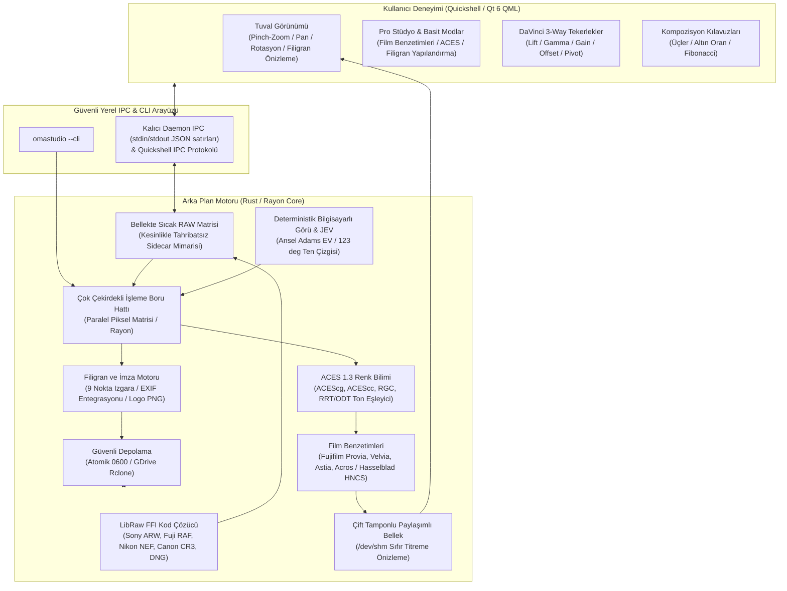

# OmaStudio

[](https://github.com/ozdil)

**Omarchy Linux için Quickshell & Rust Tabanlı 1 Numaralı Profesyonel RAW Fotoğraf Stüdyosu**

*Kayıpsız parametrik RAW düzenleme, ACES 1.3 renk yönetimi ve Referans Gamut Sıkıştırma (RGC), aslına sadık Fujifilm ve Hasselblad film benzetimleri, Hollywood standardı DaVinci 3-Way renk tekerlekleri, seçmeli profesyonel filigran motoru, çevrimdışı YZ Jev karar motoru, çift depolama (Yerel + Google Drive) ve modern çoklu format dışa aktarma mimarisi.*

[English](README.md) • [Türkçe](README.tr.md)

[](LICENSE)
[](https://omarchy.org)
[](Cargo.toml)
[](qml/)
[](CONTRIBUTING.md)
[](https://github.com/ozdil)
[](https://buymeacoffee.com/ozdil)


---

## Mimari ve Tasarım İlkeleri

OmaStudio, modern Wayland ve Hyprland Linux masaüstü ortamları için özel olarak tasarlanmış hibrit bir mimari kullanır: Kullanıcı arayüzü GPU ivmeli **Quickshell (Qt 6 / QML)** üzerinde 120/144 FPS akıcılıkla çalışırken, görüntü işleme ve RAW kod çözme boru hattı çok çekirdekli **Rust (Rayon + LibRaw FFI)** motoru tarafından yürütülür.



---

## Görüntü İşleme Boru Hattı (RAW Processing Pipeline)

Her RAW pikseli, matematiksel doğruluk ve kayıpsız dinamik aralık korunarak aşağıdaki adımlardan geçer:

```mermaid
flowchart LR
    A[" RAW Girdi<br/>(Bayer / X-Trans)"] --> B[" LibRaw<br/>Demosaicing"]
    B --> C[" Beyaz Ayarı<br/>(Planckian AWB)"]
    C --> D[" Doğrusal Pozlama<br/>(Zone System EV)"]
    D --> E[" ACES 1.3 RGC<br/>(Gamut Sıkıştırma)"]
    E --> F[" Film Benzetimi<br/>(Fuji / Hasselblad)"]
    F --> G[" DaVinci Tekerlekler<br/>(Pivot & Boost)"]
    G --> H[" Detay & Optik<br/>(Keskinlik / Denoise)"]
    H --> I[" Filigran Motoru<br/>(9 Nokta / EXIF)"]
    I --> J[" Çoklu Format Dışa Aktarım<br/>(JXL / AVIF / TIFF 16-Bit)"]
```



---

## Öne Çıkan Özellikler

### 1. ACES 1.3 Renk Yönetimi & Referans Gamut Sıkıştırma (RGC)
* **ACEScg & ACEScc Renk Uzayları:** Sahneye atıflı (scene-referred) AP1 doğrusal çalışma uzayı. sRGB, Display P3 ve Rec.2020 için yüksek hassasiyetli Bradford renk adaptasyon matrisleri.
* **ACES 1.3 Referans Gamut Sıkıştırma (RGC):** Gamut dışı ve aşırı doymuş parlak alanları akromatik eksene doğru yumuşak hiperbolik eğriyle sıkıştırır; yapay renk kırpılmalarını ve parlak kenar bozulmalarını tamamen engeller.
* **ACES 1.3 Fitted RRT/ODT Ton Eşleme:** Stephen Hill ve Krzysztof Narkowicz rasyonel polinom yaklaşımı ile analog sinema filmi karakterinde parlak alan sönümlemesi ve zengin gölge tonlaması.

### 2. Aslına Sadık Film Benzetimleri (Fujifilm & Hasselblad HNCS)
* **Fujifilm Gün Işığı ve Manzara:**
  * **Provia 100F:** Doğal gün ışığı renk üretimi, dengeli ten tonları ve nötr kontrast.
  * **Velvia 50:** Yüksek doygunluk ve canlı manzara tonları; gökyüzü mavisi ve bitki örtüsünde derin ayrım.
  * **Astia 100F:** Yumuşak kontrast ve portre fotoğrafçılığı için optimize edilmiş hassas cilt tonu geçişleri.
* **Fujifilm Belgesel ve Sinematik:**
  * **Classic Chrome:** Düşük doygunluk ve derin gölge kontrastıyla belgesel fotoğrafçılığı tonları.
  * **Classic Neg:** Superia renkli negatif film karakterinde sıcak tonlar ve belirgin orta ton kontrastı.
  * **Eterna Cinema:** Düz gama ve yumuşak parlak alan geçişiyle sinematik film profili.
* **Fujifilm Acros Efsanevi Siyah-Beyaz:**
  * **Acros Standard:** Ultra ince gren ve zengin ton geçişlerine sahip efsanevi siyah-beyaz simülasyonu.
  * **Acros (+Ye) Sarı Filtre:** Dengeli kontrast artışı; gökyüzü ve portrelerde doğal ayrım.
  * **Acros (+R) Kırmızı Filtre:** Dramatik koyu gökyüzü ve yüksek mikro kontrast.
  * **Acros (+G) Yeşil Filtre:** Yeşil yaprakları öne çıkarırken dudak ve ten tonlarını yumuşatır.
* **Hasselblad Orta Format Profilleri:**
  * **Hasselblad Natural Colour Solution (HNCS):** 4. dereceden kök kroma ölçeklemesiyle stüdyo kalitesinde nötr gri kararlılığı.
  * **Hasselblad XPan:** 35mm panoramik sinematik kontrast ve derin gölge sıkıştırması.

### 3. Seçmeli Fotoğrafçılık Filigran ve İmza Motoru
* **9 Nokta Izgara Hizalama:** Tuval üzerinde 9 farklı konuma yerleşim (Sol-Üst, Üst-Orta, Sağ-Üst, Orta-Sol, Merkez, Orta-Sağ, Sol-Alt, Alt-Orta, Sağ-Alt).
* **Otomatik EXIF Etiket Değişimi:** Çekim meta verilerini otomatik algılama ve metne işleme: `{camera}`, `{lens}`, `{aperture}`, `{shutter}`, `{iso}`, `{focal}`.
* **Özel Logo Ekleme:** Harici PNG logolarını Lanczos3 yeniden örnekleme ve alfa şeffaflığıyla fotoğrafa işleme.
* **Canlı Tuval Önizlemesi:** Yeniden render beklemeden tuval üzerinde sıfır gecikmeli canlı filigran önizlemesi.
* **Dışa Aktarım Entegrasyonu:** JPEG XL, AVIF, WebP, TIFF 16-bit, PNG ve JPEG dosyalarına doğrudan kalıcı gömme.

### 4. Kesinlikle Tahribatsız (Non-Destructive) RAW İş Akışı
* **Orijinal RAW Dosyaları Asla Değiştirilmez:** Sensör RAW dosyaları yalnızca salt okunur (read-only) açılır; kaynak dosyanın hiçbir baytı üzerine yazılmaz.
* **Parametrik Yan Dosya (Sidecar) Mimarisi:** Tüm düzenlemeler, renk derecelendirmeleri, kırpmalar ve meta veriler atomik `.omastudio` JSON dosyalarında Mod 0600 izinleriyle saklanır.

### 5. Yüksek Hassasiyetli 16-Bit / 26-Bit Orta Format Motoru
* **Orta Format Sensör Desteği:** Fujifilm GFX serisi (GFX 100 II, GFX 100S, GFX 50S), Hasselblad (`.3FR`, `.DNG`) ve Phase One 16-bit 100+ MP devasa sensörler.
* **16-Bit Matematiksel İşleme:** Derin gölge (+4 EV, +100 Shadows) ve aşırı ışık kurtarmalarında basamaklanmayı (banding) önleyen 48-bit RGB matrisi.
* **Master 16-Bit Çıktı:** Sergi ve arşiv baskıları için gerçek 16-bit TIFF ve 16-bit PNG üretimi.

### 6. Deterministik Bilgisayarlı Görü & Çevrimdışı JEV Motoru
* **Doğrusal Ansel Adams Zone Pozlama:** Pozlama telafisini doğrusal aydınlık üzerinden hesaplar; 99. yüzdelik tavan korumasıyla parlak alan patlamalarını önler.
* **Planckian Kara Cisim AWB:** 2400K ile 9500K aralığında sürekli renk sıcaklığı (CCT) tahmini.
* **123 Derece Ten Çizgisi Vektorskop Koruması:** Cilt tonu renklerini ortam doygunluğundan bağımsız olarak vektorskop üzerinde koruma altına alır.
* **Çoklu İpucu Belirginlik (Saliency) & Üçler Kuralı:** Kompozisyon analiziyle otomatik akıllı kadrajlama.
* **Çevrimdışı JEV Zekası:** İnternet veya harici API erişimi bulunmadığında dahi yerel Bayes karar motoruyla stüdyo seviyesinde otomatik reçeteler oluşturur.

### 7. DaVinci Resolve Kalitesinde Renk Bilimi & Canlı Skoplar
* **Contrast Pivot:** S-eğrisi merkez noktasını (0.05-0.95, varsayılan 0.435) gölgeleri ezmeden genişletme.
* **DaVinci Color Boost:** Düşük doymuş renkleri yükseltirken doymuş alanları patlamadan koruyan doğrusal olmayan kroma artırıcı.
* **Midtone Detail (MD):** Frekans ayrıştırma ile orta frekansları izole ederek mikro doku keskinleştirme veya cilt yumuşatma.
* **Canlı Video Skopları (60+ FPS):** Luma Waveform, RGB Parade ve 123 derece ten çizgili Vektorskop.
* **3D LUT Motoru (.cube):** Donanım düzeyinde trilineer enterpolasyon ve yerleşik sinema profilleri.
* **Yerel Derecelendirme Sürümleri (A/B/C/D):** `Alt + 1..4` kısayollarıyla anında sürüm dallanması ve klonlama.

### 8. Wayland & Hyprland 120Hz/144Hz Sıfır Titreme Mimarisi
* **Çift Tamponlu Paylaşımlı Bellek:** `/dev/shm` ping-pong çerçeve tamponlarıyla slider hareketlerinde sıfır titreme.
* **Mac Kalitesinde Touchpad Ergonomisi:** Kesintisiz logaritmik yakınlaştırma, 3.5 derece ölü bölgeli akıllı rotasyon ve kinetik süzülme.

---

## Karşılaştırma Tablosu

| Özellik | OmaStudio | Adobe Lightroom | Darktable | RawTherapee |
| :--- | :---: | :---: | :---: | :---: |
| **Lisans & Özgürlük** | **Açık Kaynak (MIT)** | Tescilli / Aylık Abonelik | GPLv3 | GPLv3 |
| **Masaüstü Uyumu** | **Omarchy & Quickshell** | Yalnızca macOS / Windows | GTK | GTK |
| **ACES 1.3 & RGC** | **Doğal ACEScg / ACEScc / RGC**| Kısmi / Eklenti Gerekir | Karmaşık Modüller | Karmaşık Profiller |
| **Film Benzetimleri** | **Orijinal Fuji & Hasselblad** | Hazır Ayar Paketleri | Eğriler | HaldCLUT |
| **Filigran Motoru** | **9 Nokta Izgara & EXIF** | Yalnızca Dışa Aktarım | Filigran Modülü | Filigran Modülü |
| **DaVinci Renk Bilimi** | **Doğal (Pivot / Boost / MD)** | Kısmi | Karmaşık Modüller | Karmaşık Profiller |
| **Gerçek Zamanlı Skoplar** | **Waveform, Parade, Vektorskop** | Yalnızca Histogram | Ayrı Pencereler | Ayrı Sekmeler |
| **3D LUT (.cube) & Karışım**| **Donanım Trilineer & Hazır Ayar**| Profil Kütüphanesi | LUT Modülü | Yalnızca HaldCLUT |
| **Yerel Sürümler (A/B/C/D)** | **Kısayol ile Anında Geçiş** | Anlık Görüntüler | Geçmiş Yığınları | Anlık Görüntüler |
| **JPEG XL / AVIF Çıktısı** | **Donanım Hızlandırmalı** | Kısıtlı | Eklenti ile | Kısmi |
| **Bulut Entegrasyonu** | **Google Drive (Rclone FFI)** | Adobe Cloud (Zorunlu) | Yok | Yok |
| **Bellek Tüketimi** | **Hafif (~35 MB RAM)** | Ağır (2+ GB RAM) | Orta (~400 MB) | Orta (~350 MB) |

---

## Kurulum ve Kullanım

### Sistem Gereksinimleri
* `libraw` (RAW kod çözme motoru)
* `quickshell` (Qt 6 QML masaüstü kabuk çalışma zamanı)
* `rclone` (Google Drive bulut depolama senkronizasyonu)
* `libjxl` & `libavif` (Modern donanım ivmeli görsel kodekleri)
* `exiftool` (Meta veri ve ICC profil gömme aracı)
* `zenity` (Masaüstü dosya seçim pencereleri)
* `rust` (Yerel motor derleme araç zinciri)

### Yerel Derleme ve Kurulum
```bash
# Projeyi derleyin
cargo build --release --locked

# İkili dosyayı yerel kullanıcı dizinine kurun
install -d -m 755 ~/.local/bin
install -m 755 target/release/omastudio-engine ~/.local/bin/

# OmaStudio uygulamasını başlatın
omastudio
```

---

## Klavye Kısayolları

* `Ctrl + O`: RAW dosya açma penceresi
* `Ctrl + S`: Ayar yan dosyasını kaydet (`.omastudio`, Mod 0600)
* `Alt + 1..4`: Derecelendirme sürümleri arasında geçiş (A, B, C, D)
* `C`: Kırpma ve kompozisyon kılavuzlarını aç/kapat (Üçler Kuralı, Altın Oran, Fibonacci)
* `Y`: Önce / Sonra (A|B) bölünmüş karşılaştırma
* `Ctrl + Shift + C`: Ayarları panoya kopyala
* `Ctrl + Shift + V`: Ayarları geçerli fotoğrafa yapıştır
* `Ctrl + R`: Tüm ayarları varsayılanlara sıfırla
* `Çift Tıklama`: Ekrana Sığdır (%100) ve Birebir Piksel İnceleme (%200) arasında geçiş

---

## Güvenlik Standartları (`CONTRIBUTING.md`)

OmaStudio, Omarchy Linux Güvenlik Standartlarına tam uyum sağlar:
1. **İzole Süreç Grupları (`cmd.process_group(0)`):** Alt süreçler bağımsız PGID altında çalıştırılır; zaman aşımında RAII `ProcessGroupGuard` ile temizlenir ve zombi süreç bırakmaz.
2. **Korumalı Dosya İzinleri (`0600` / `0700`):** Yapılandırma ve kataloglar atomik geçici dosyalarla Mod 0600 olarak kaydedilir; sembolik bağlar reddedilir.
3. **Quickshell Sertleştirmesi:** Dinamik metinler `textFormat: Text.PlainText` ile güvenli şekilde render edilir; dinamik `eval()` kullanımı kesinlikle yasaktır.
4. **Argüman Enjeksiyonu Savunması:** Harici komutlar ayrık argüman dizisi ve `--` bayrağı ile yürütülür.

---

## Destek ve Geliştirme

OmaStudio projesini faydalı buluyor ve bağımsız açık kaynak Linux yazılım ekosistemini desteklemek istiyorsanız:

<a href="https://buymeacoffee.com/ozdil" target="_blank"></a>

---

## Lisans
MIT Lisansı (c) 2026 Ozan Özdil
