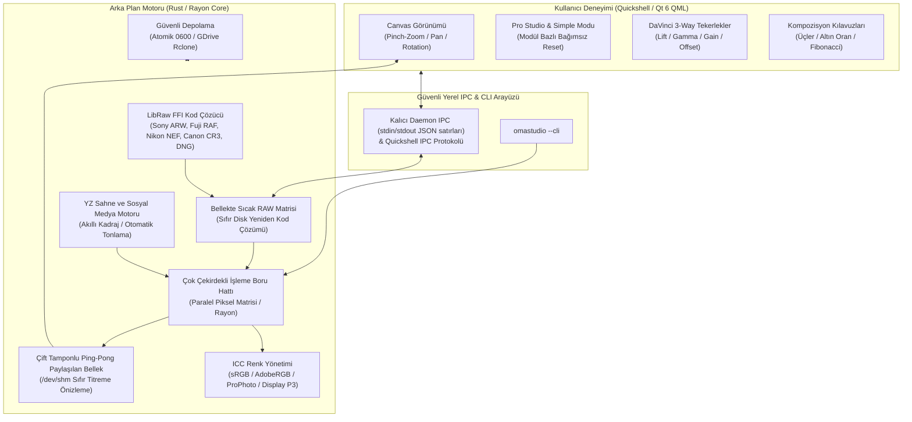

# OmaStudio

**Omarchy Linux için Quickshell & Rust Tabanlı Profesyonel RAW Fotoğraf Editörü**

*Lightroom RAW kalitesinde parametrik düzenleme, Hollywood standardı DaVinci 3-Way renk tekerlekleri, yapay zeka destekli akıllı sosyal medya optimizasyonu, çift depolama (Yerel + Google Drive) ve yeni nesil açık kaynak dışa aktarma motoru.*

[English](README.md) • [Türkçe](README.tr.md)

[](LICENSE)
[](https://omarchy.org)
[](Cargo.toml)
[](qml/)
[](CONTRIBUTING.md)
[](https://github.com/ozdil)
[](https://buymeacoffee.com/ozdil)


---

## Mimari ve Çalışma Prensibi

OmaStudio, modern Linux masaüstünde yüksek performanslı fotoğraf düzenleme için hibrit bir mimari kullanır: Kullanıcı arayüzü GPU ivmeli **Quickshell (Qt 6 / QML)** üzerinde 60+ FPS ile çalışırken, görüntü işleme ve RAW kod çözme boru hattı çok çekirdekli **Rust (Rayon + LibRaw FFI)** motoru tarafından yürütülür.



---

## Görüntü İşleme Boru Hattı (RAW Processing Pipeline)

Her RAW pikseli, matematiksel doğruluk ve kayıpsız dinamik aralık korunarak aşağıdaki adımlardan geçer:

```mermaid
flowchart LR
    A[" RAW Girdi<br/>(Bayer / X-Trans)"] --> B[" LibRaw<br/>Demosaicing"]
    B --> C[" Beyaz Ayarı<br/>(Kelvin & Tint)"]
    C --> D[" Pozlama<br/>(EV Logaritmik)"]
    D --> E[" Işık & Dinamik Aralık<br/>(Whites/Blacks/Highlights/Shadows)"]
    E --> F[" 8-Band HSL<br/>Renk Mikseri"]
    F --> G[" DaVinci 3-Way<br/>Renk Tekerlekleri"]
    G --> H[" Detay & Optik<br/>(Keskinlik / Denoise / Defringe)"]
    H --> I[" ICC Profil Çıktısı<br/>(sRGB / AdobeRGB / P3)"]
    I --> J[" Çoklu Dışa Aktarma<br/>(JPEG XL / AVIF / WebP / TIFF / JPEG)"]
```



---

## Öne Çıkan Özellikler

### 1. Kapsamlı RAW & 16-Bit Medium Format (Orta Format) Desteği
* **Orta Format (Medium Format):** Fujifilm GFX serisi (GFX 100 II, GFX 100S, GFX 50S vb.), Hasselblad (`.3FR`, `.DNG`) ve Phase One 16-bit 100+ MP devasa sensörler.
* **16-Bit Kayıpsız Renk Derinliği (48-bit RGB):** Derin gölge (+4 EV, +100 Shadows) ve parlak alan kurtarmada 8-bit kuantizasyon basamaklanmasını (banding) sıfıra indiren tam 16-bit matematiksel işleme boru hattı.
* **Master 16-Bit Dışa Aktarma:** Baskı ve arşiv için gerçek 16-bit TIFF ve 16-bit PNG (48-bit RGB) çıktısı, geniş renk gamlı JXL ve AVIF desteği.
* **Nikon:** `.NEF`, `.NRW` (Z8 / Z9 High-Efficiency HE/HE* dahil)
* **Fujifilm:** `.RAF` (X-Trans II/III/IV/V 6x6 matris sensörleri ve Bayer)
* **Canon:** `.CR2`, `.CR3` (ISOBMFF tabanlı)
* **Sony:** `.ARW`, `.SR2` (Alpha 7/9/1 serisi)
* **Leica & Evrensel DNG:** `.DNG`, `.RWL` (M, SL, Q serileri, drone ve akıllı telefonlar)
* **Diğer:** Olympus (`.ORF`), Panasonic (`.RW2`)

### 2. Mac Kalitesinde Touchpad & Mouse Ergonomisi (1:1 macOS Deneyimi)
Linux masaüstündeki en büyük eksikliklerden biri olan "kaba veya kontrolsüz dokunmatik tepkileri" tamamen çözüldü. OmaStudio, **Apple Magic Trackpad ve macOS tuval ergonomisiyle 1:1 aynı hissi** sunar:
* **İki Parmak Çimdik Yakınlaştırma (Pinch-to-Zoom):** İmlecin veya parmakların odaklandığı piksel merkezine kesintisiz, logaritmik ve sıçramasız yakınlaştırma.
* **Akıllı Rotasyon & 3.5° Ölü Bölge (Deadzone):** Fotoğrafı yakınlaştırırken parmakların istemsizce kayıp resmi eğmesini engelleyen akıllı deadzone filtresi; bilinçli döndürmelerde ise 360° serbest tuval çevirme.
* **İki Parmak Akıcı Kaydırma (Kinetik Pan):** Yakınlaştırılmış fotoğrafta Mac'teki gibi pürüzsüz süzülme (`0.75` sönümlenmiş kinetik sürtünme).
* **Çift Tıklama / Çift Dokunma (Double-Tap):** Ekrana sığdırma (%100 Fit) ile %200 piksel seviyesi detay inceleme arasında anında geçiş ve açıyı sıfırlama.
* **Fare & Touchpad Ayrımı (`WheelHandler`):** Fare tekerleği imleç odaklı logaritmik zum yaparken, touchpad iki parmakla kaydırmada yumuşak pan yapar; `Alt + Wheel` ise 1.5° hassasiyetle mikro açı düzeltmesi sağlar.
* **Uçup Kaybolmayı Önleyen Sınırlandırma (`clampPan`):** Resmin hızlı hareketlerde ekrandan kaybolmasını önleyen akıllı kenar çıpaları.

### 3. Modül Bazlı Bağımsız "Reset" & Çift Seviyeli Arayüz
* **Basit Mod (Hızlı İş Akışı):** Tek tıkla YZ Otomatik İyileştirme ve 4 temel sürgü (Pozlama, Sıcaklık, Canlılık, Kontrast).
* **Pro Studio Modu:** Her modül başlığında bağımsız **RESET** butonu:
  * **White Balance:** 2,000K – 12,000K Kelvin ve Yeşil/Macenta Tint sıfırlama.
  * **Light & Dynamic Range:** Pozlama, Kontrast, Highlights, Shadows, Whites ve Blacks sıfırlama.
  * **Presence & Texture:** Doku, Netlik (Clarity), Sis Giderme (Dehaze), Canlılık (Vibrance), Satürasyon sıfırlama.
  * **Color Mixer (8-Band HSL):** Kırmızı, Turuncu, Sarı, Yeşil, Akuamarin, Mavi, Mor, Macenta kanallarının tek tıkla toplu sıfırlanması.
  * **Detail & Optics:** Keskinlik, Kumlanma Temizleme (NR), Vinyet, Defringe (renk saçaklanması giderme) ve Lens Distorsiyonu sıfırlama.
  * **DaVinci 3-Way Wheels:** Lift, Gamma, Gain, Offset tekerleklerini tek tıkla nötrleme.

### 4. Yapay Zeka Destekli Sosyal Medya Optimizatörü
Platforma özel çözünürlük, en boy oranı ve algoritma sıkıştırma kayıplarını telafi eden mikro-kontrast ön ayarları:

| Platform | En-Boy | Çözünürlük | Profil Hedefi |
| :--- | :---: | :---: | :--- |
| **Instagram Feed** | `4:5` | 1080 × 1350 | Dikey maksimum alan, kompresyon önleyici kenar keskinliği |
| **Reels / Stories / TikTok** | `9:16` | 1080 × 1920 | Tam ekran dikey kadraj, mobil OLED canlılık artırma |
| **X (Twitter)** | `16:9` | 1200 × 675 | Masaüstü/mobil akış optimizasyonu, net mikrokontrast |
| **Kare Portre** | `1:1` | 1080 × 1080 | Klasik ızgara uyumu ve profil sergisi |
| **Facebook HD** | `1.91:1`| 2048 × 1072 | Yüksek çözünürlüklü albüm ve sayfa paylaşımı |
| **YouTube Thumbnail** | `16:9` | 1280 × 720 | Yüksek tıklama oranı (CTR) için canlı renk doygunluğu |

### 5. DaVinci Resolve Seviyesi Renk Bilimi & Gerçek Zamanlı Video Skoplari
* **DaVinci Renk Bilimi Ton Kontrolleri:**
  * **Contrast Pivot:** Kontrast eğrisinin pivot merkez noktasını (0.05 - 0.95, varsayılan 0.435 / %18 orta gri) ayarlayarak gölgeleri çökertmeden ve parlak alanları patlatmadan dinamik aralık açma.
  * **DaVinci Color Boost:** Geleneksel satürasyonun aksine doymuş tonları koruyan, doygunluğu düşük alanları kademeli artıran ve cilt tonlarını aşırı doymadan koruyan akıllı algoritma.
  * **Midtone Detail (MD):** Gauss bant-geçiren filtre frekans ayrışımı ile orta frekans lüminans dokusunu izole ederek cilt gözeneklerini yumuşatma (güzellik rötuşu) veya kumaş/mimari dokuları keskinleştirme.
* **Hollywood Standardı 4 Gerçek Zamanlı Video Skobu (Tek Geçişli 60 FPS):**
  * **Luma Waveform:** Yatay eksende 64x32 analog fosfor parlaklık dağılımı (IRE 0-100 ölçeği).
  * **RGB Parade:** Kırmızı, Yeşil ve Mavi kanallarını 32x32 bağımsız ayrıştırarak beyaz dengesi ve renk sapmalarını hassas hizalama.
  * **Vectorscope (Cb/Cr Polar Radar):** 48x48 renk tonu ve doygunluk radarı üzerinde kalibre edilmiş 123 derecelik **Skin Tone Line (I-Bar)** ten rengi referans çizgisi.
  * **256 Seviyeli Histogram:** Gerçek zamanlı lüminans ve RGB ton dağılımı.
* **3D LUT Motoru & Film Emülasyonu:**
  * Standart `.cube` dosyalarını ayrıştıran yüksek başarımlı 3 boyutlu trilineer enterpolatör.
  * Dahili Hollywood sinematik ön ayarları: Kodak 2383 Print Film, Teal & Orange Blockbuster, Fuji Eterna ve Silver Nitrate Monochrome.
  * Değişken Karışım / Yoğunluk sürgüsü (%0 - %100) ve katı güvenlik doğrulaması (1 MiB sınır, symlink reddi).
* **Grade Versions (Local Versions A/B/C/D):**
  * Her fotoğraf için 4 bağımsız derecelendirme versiyon yuvası.
  * Kısayolla hızlı geçiş (`Alt + 1` .. `Alt + 4`) ve tek tıkla kopyalama (`Copy to Other`) ile hızlı yaratıcı karşılaştırma.

### 6. Yeni Nesil (SOTA) RAW İnovasyonları ve Sıfır Güven Motoru (v1.1.0)
* **Lüminans Kılavuzlu Parlak Alan Onarımı (Highlight Reconstruction):**
  * Aşırı pozlanmış veya patlamış sensör verilerinde bir veya iki renk kanalı doyuma ulaştığında (clipping), sağlam kalan kanallar ve parlaklık gradyanları kullanılarak patlak pikseller onarılır; sert gökyüzü veya stüdyo ışıklarındaki istenmeyen macenta/camgöbeği renk sapmaları tamamen engellenir.
* **AgX & Filmic Sigmoidal Ton Haritalama (AgX Curve):**
  * Fotokimyasal negatif film parlak alan geçiş eğrisini (roll-off) emüle eder. Beyaz sınırında pikselleri sertçe kesmek veya düz beyaza sıkıştırmak yerine, parlak tonları yumuşak bir desatürasyonla beyaz eğrisine bağlar; gelinlik, bulut ve doğrudan ışık kaynaklarındaki mikro dokuları korur.
* **JEV System 1 YZ Fotoğraf Sezgisi (JEV-PHOTO-04 Kuralı):**
  * Yüksek ISO akıllı tavan denetimi: Aşırı duyarlılıkta (ISO >= 3200) gölge açma miktarı sınırlandırılarak (`shadows.min(25.0)`) gürültü patlaması önlenir, kroma temizliği desteklenir ve lens optik vinyet telafisi uygulanır.
* **Sıfır Sızıntılı Bellek Mimarisi (LibRaw C FFI):**
  * Başarısızlık durumunda korumalı bellek tahsis denetimleri ve her kod çözme adımında garantili `libraw_dcraw_clear_mem` çağrısı ile toplu RAW işleme süreçlerinde bellek sızıntıları tamamen ortadan kaldırılmıştır.

---

## Karşılaştırma Matrisi

| Özellik | OmaStudio | Adobe Lightroom | Darktable | RawTherapee |
| :--- | :---: | :---: | :---: | :---: |
| **Lisans & Özgürlük** | **Açık Kaynak (MIT)** | Tescilli / Aylık Abonelik | GPLv3 | GPLv3 |
| **Yerel Entegrasyon** | **Omarchy & Quickshell** | Yalnızca macOS/Windows | GTK | GTK |
| **DaVinci Renk Bilimi** | **Yerleşik (Pivot / Boost / MD)** | Kısmi | Karmaşık Modüller | Karmaşık Profiller |
| **Gerçek Zamanlı Video Skoplari** | **Waveform, Parade, Vectorscope (I-Bar)** | Yalnızca Histogram | Ayrı Pencereler | Ayrı Sekmeler |
| **3D LUT (.cube) & Karışım** | **Donanım Trilineer & Ön Ayarlar** | Profil Kütüphanesi | LUT Modülü | Yalnızca HaldCLUT |
| **Yerel Versiyonlar (Versions)** | **A/B/C/D Anında Kısayollar** | Enstantaneler | Geçmiş Yığınları | Enstantaneler |
| **JPEG XL / AVIF Çıktısı** | **Donanım İvmeli** | Kısıtlı | Eklenti ile | Kısmi |
| **Sosyal Medya YZ Şablonları**| **Tek Tıkla Otomatik** | Manuel | Manuel | Manuel |
| **Bulut Entegrasyonu** | **Google Drive (Rclone FFI)**| Adobe Cloud (Zorunlu) | Yok | Yok |
| **Kaynak Tüketimi** | **Hafif (~35 MB RAM)** | Ağır (2+ GB RAM) | Orta (~400 MB) | Orta (~350 MB) |

---

## Kurulum & Çalıştırma

### Sistem Gereksinimleri ve Bağımlılıklar
* `libraw` (RAW görsel çözme motoru)
* `quickshell` (Qt 6 QML masaüstü kabuk çalışma zamanı)
* `rclone` (Google Drive ve bulut depolama senkronizasyonu)
* `libjxl` & `libavif` (Donanım hızlandırmalı modern görsel kodekleri)
* `zenity` (Yerel dosya seçim pencereleri)
* `rust` (Yerel motorun derlenmesi için araç zinciri)

### Derleme & Yerel Kurulum
```bash
# Projeyi klonlayın ve derleyin
cargo build --release --locked

# İkili dosyayı yerel yola kurun
install -d -m 755 ~/.local/bin
install -m 755 target/release/omastudio-engine ~/.local/bin/

# Uygulamayı başlatın
omastudio
```

---

## Klavye ve İş Akışı Kısayolları

* `Ctrl + O`: RAW fotoğraf açma diyaloğu
* `Ctrl + S`: Düzenleme tarifini yan dosya olarak kaydetme (`.omaraw`, Mod 0600)
* `Alt + 1..4`: Grade Versiyonları (Versiyon A, B, C, D) arasında anında geçiş
* `C`: Kırpma ve Kompozisyon Modu (Üçler, Altın Oran, Fibonacci)
* `Y`: Öncesi / Sonrası (Split A|B) karşılaştırma
* `Ctrl + Shift + C`: Tüm renk ve tonlama tarifini panoya kopyalama
* `Ctrl + Shift + V`: Kopyalanan tarifi seçili fotoğrafa uygulama
* `Ctrl + R`: Tüm ayarlamaları fabrika çıkışına sıfırlama
* `Double Click`: %100 Fit ve %200 Piksel Görünümü arasında geçiş

---

## Güvenlik Standartları (`CONTRIBUTING.md`)

OmaStudio, Omarchy Linux resmi güvenlik kılavuzuna koşulsuz olarak uyar:
1. **İzole Süreç Grupları (`cmd.process_group(0)`):** Harici yardımcı araçlar bağımsız PGID ile çalıştırılır; zaman aşımında RAII `ProcessGroupGuard` ile zombi süreç bırakılmadan SIGTERM ve SIGKILL ile temizlenir.
2. **Korumalı Dosya İzinleri (`0600` / `0700`):** Fotoğraf katalogları ve ayarlar `0600` izniyle atomik olarak yazılır (`.tmp_...` + `fs::rename`); symlink saldırıları sıkıca reddedilir.
3. **Quickshell Güvenliği:** Dinamik veriler `textFormat: Text.PlainText` ile gösterilir; dinamik `eval()` veya `createQmlObject()` bulunmaz.
4. **Argüman Enjeksiyonu Koruması:** Sistem komutları asla kabuk dizesi ile çalıştırılmaz, ayrık bağımsız argüman dilimleri ve `--` sınırlayıcısı kullanılır.

---

## Destek & Sponsorluk

OmaStudio'yu faydalı buluyorsanız ve bağımsız açık kaynak Linux yazılım geliştirmesine katkıda bulunmak isterseniz:

<a href="https://buymeacoffee.com/ozdil" target="_blank"></a>

---

## Lisans
MIT License © 2026 Ozan Özdil
